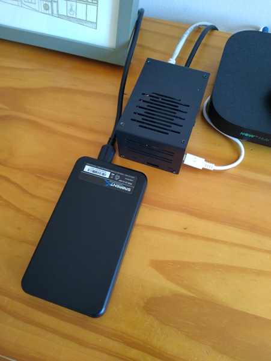
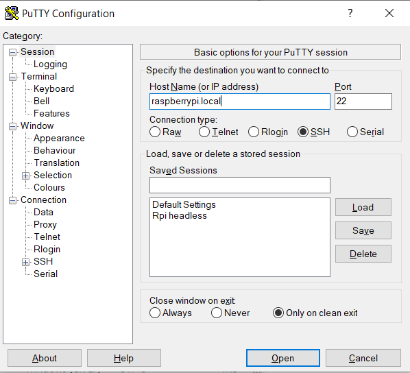
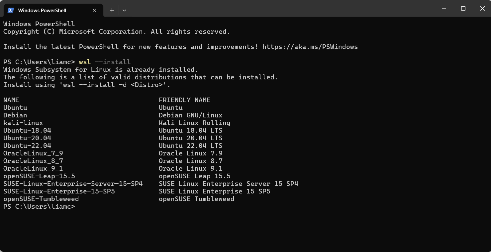
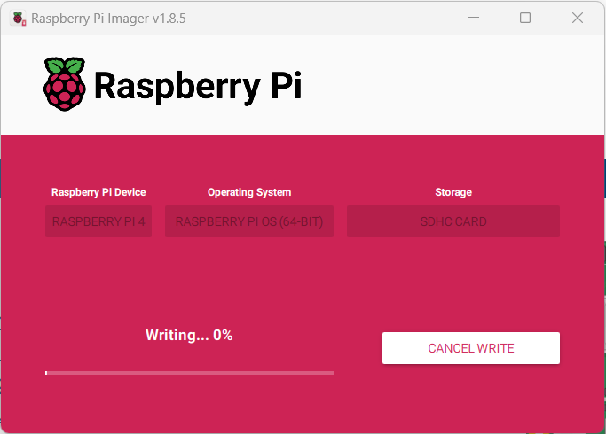
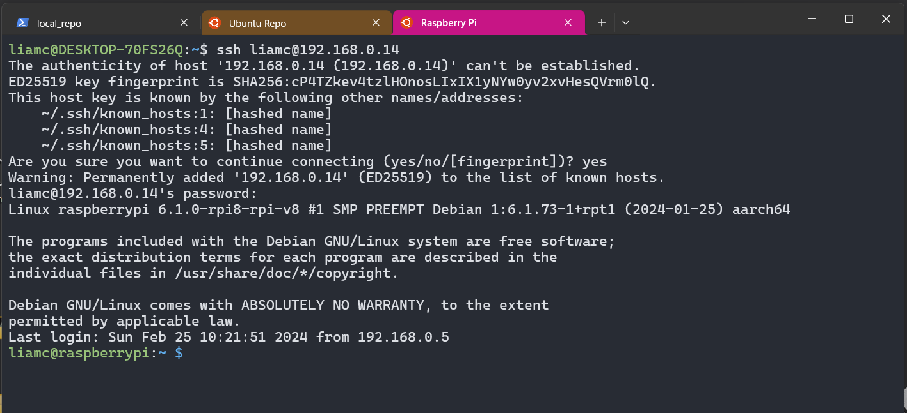

## Project goals
### Original goals

The original project definition was:  
 - set up a headless Raspberry Pi
 - connect to the Pi through SSH from an Ubuntu VM on my Windows machine (I thought this was a good idea as this was how I connected to a Bitcoin node I had run on the Pi previously...) 
 - set up a SQLite database
 - pull the data off the SQLite db  
 - perform some data cleaning 
 - migrate the clean data onto a PostgreSQL db  
 - Bonus: do a live pull of some data and plot a pretty graph  

I was rapidly overwhelmed, however, and hit a lot of sticking points that made me realise the goals were a little too lofty.  



### Sticking points
**Couldn't connect to the Raspberry Pi over SSH through the Ubuntu VM**  
I'd managed this before when running a Bitcoin node, but that was over a different ISP where enabling port-forwarding was a bit simpler.  



**Getting data**  
Being fairly new to the world of databases, I was surprised by how difficult it was to find a dataset. I didn't know where to look.  
I ended up settling for some data I pulled off Kaggle:  [shop customer data](https://www.kaggle.com/datasets/datascientistanna/customers-dataset), [urban ecology over time](https://www.kaggle.com/datasets/thedevastator/urban-coyote-activity-and-diet-data-during-covid), [weeds in cultivation fields](https://www.kaggle.com/datasets/thedevastator/weed-plant-taxonomy-in-france-and-uk).

The idea was that the data would be something akin to what the company I was interviewing for would use, i.e. the data would be relational, and in one of the following categories:
- operational
- financial
- ecological    

**Creating the database**  
At the point of starting the project, I had learned some basic Python and SQL, and felt fairly confident that I could, with enough time and resources, create a straightforward database connection in Python. That confidence faded quickly. I had already stumbled at the first two hurdles, and it didn't take long for me to struggle with this and decide to revise the project goals.  

#### Revised original goals  
 - create the databases and perform the migration locally (no Raspberry Pi)
 - write a Python script to retrieve the data from the SQLite db, clean the data, and write to a PostgreSQL database. 
 - use the Holywell style guide for the SQL code  
 - Bonus: perform a quick data pull and plot a graph  

#### More problems  
- couldn't set up the SQLite database  
- couldn't set up the PostgreSQL database  
- the data is not relational!  

A key requirement of relational databases is that the data tables are related... it was quite comical how long it took me to realise the data I had gathered wasn't.  

Despite refreshing the plan and setting more reasonable goals, I continued to struggle. The interview date was moving closer, I was still in a full-time job, and my anxiety levels were rising. I would say I was wondering why I had set such an ambitious target, but I really did think the original project remit was achievable. I also thought that the project-based approach would give me exactly what I needed to point to for the presentation topic definition.  

#### Why I got stuck the first time around
Reflecting on the original project, I think the main reasons I met the challenges I did were:

**Lack of technical skills**  
If I was a whizz with Python and SQL at the time, the technical work would have been much easier. It's not a particularly difficult task, but I put hurdles in that I didn't need to, and some hurdles I didn't predict.  

**No good project management system**  
The project was spread across Notion, word documents, paper, PowerPoint, and my head. I even set the  goal of creating the presentation with Quarto, which I had never used before.  
As someone who needs simple systems, this was enough to set my head spinning. Thankfully, this time around I have a bit more experience with the wonderfully simple but powerful markdown. And git. Both of which I intend to leverage heavily for version 2. 

**Nerves**  
I really wanted this job, but it was my first interview for a position of this kind. Jobs I interviewed for previously didn't require this level of preparation.

### Version 2 goals

 - Create a WSL development environment
 - Set up a Raspberry Pi (doesn't have to be headless) 
 - Document the whole process with markdown files and git  
 - Use the [Chinook database](https://www.sqlitetutorial.net/sqlite-sample-database/), so I don't have to worry about schema and getting data  
 - Set the Chinook database up on SQLite  
 - Migrate the data to a PostgreSQL db  
 - Bonus: plot some data  

#### What I plan to do differently this time  

I'll also dedicate time to the project in a more structured way, and leverage the following technologies:
- Visual Studio Code for a nice project development environment
- Git and GitHub for version control
- Obsidian for markdown editing

These goals are very similar to the original remit, but 7 months has passed, and I think I have the time and skillset to make it happened this time.  

# Process

## Install WSL

I learned how to do this [here](https://learn.microsoft.com/en-us/windows/wsl/install)
1. Enter windows features, enable WSL
2. Restart your computer
3. Or open PowerShell, run the following commands:

Install WSL
```PowerShell
wsl --install
```

To install Ubuntu (other distros are available for install w/ WSL)
```PowerShell
wsl --install -d Ubuntu-22.04
```

Update Linux kernels
```Powershell
wsl.exe --update
```

Set WSL 2 as the default version
```Powershell
wsl --set-default-version 2
```


## Add a gitignore

I used Obsidian as my markdown editor, and was committing the obsidian source files to this GitHub repo, so needed to add a `gitignore` file to remove these files from future commits.

Having never used a `gitignore` file, this was the perfect chance to learn. I used [this freecodecamp tutorial](https://www.freecodecamp.org/news/gitignore-file-how-to-ignore-files-and-folders-in-git/) as a reference.

To create the `.gitignore` file:
```bash
touch .gitignore
```

Then to tell git to ignore the obsidian source files:
```shell
echo ".obsidian/" >> .gitignore
```

Then to remove the obsidian files from the repo without deleting them locally:
```shell
git rm -r --cached .obsidian/
```

Stage the new gitignore file:
```shell
git add .gitignore
```

And finally commit the changes:
```shell
git commit -m "update ignored files"
```

## Set up the Raspberry Pi

I already had Raspbian installed on the microSD I was using in the Pi, but had forgotten the login details, so formatted the card and put a fresh install of Raspberry Pi OS (64-bit) desktop with Raspberry Pi imager.

With the fresh OS installed, it was a simple process of:
- Insert the new SD card
- Plug in the monitor and power supply
- Create a new login

Download the Raspberry Pi imager [here](https://www.raspberrypi.com/software/).



Write a version of Raspberry Pi OS to an SD card. I chose the desktop version or Raspberry Pi OS over the headless version, because I have a second monitor, and it gave me the option to work right on the Pi if I struggle with `SSH` as I did the first time around.
## Preparing VS Code

Since I wanted to use VS code to manage some of the project, I was pleasantly surprised to find [this guide](https://learn.microsoft.com/en-us/windows/wsl/tutorials/wsl-vscode) on how to open a WSL project in VS code. I followed the steps to:
- open VS code inside the local project directory
- install the WSL extension
- install the remote development pack

Next, I updated Ubuntu
```Bash
sudo apt-get update
```

And the wget (not sure if needed, but installed just in case)
```Shell
sudo apt-get install wget ca-certificates
```

Then install Python via the extensions window, and clone this repo in a new WSL project directory.

## Accessing the Pi with SSH

With the Raspberry Pi connected to your local network, find the IP address. This can be done via the settings if connected to a monitor, or by running the following command from your main machine:

```Bash
ping raspberrypi.local
```

You'll need to enable SSH in both your Raspberry Pi and main machine, which can be found [here](https://www.raspberrypi.com/documentation/computers/remote-access.html#secure-shell-from-linux-or-mac-os) and [here](https://code.visualstudio.com/docs/remote/troubleshooting#_ssh-tips) respectively.

Then to access your Pi from Ubuntu
```Bash
ssh username@<ipaddress>
```

You'll be prompted to enter the user login details, after which you should be met by the Raspberry Pi command prompt



## Installing SQLite

I then installed SQLite3 to host the first database. I followed [this guide](https://pimylifeup.com/raspberry-pi-sqlite/).

First update the Raspberry Pi's OS
```Terminal
sudo apt update
sudo apt full-upgrade
```

And then install SQLite
```Terminal
sudo apt install sqlite3
```


## Creating the a database

I downloaded the Chinook dataset from [this tutorial](https://www.sqlitetutorial.net/sqlite-sample-database/). 

Save the file to the local repo (in WSL), and secure-copy to the Raspberry Pi over SSH

learned [here](https://www.raspberrypi.com/documentation/computers/remote-access.html#secure-shell-from-linux-or-mac-os).

Copy the chinook directory
```Shell
scp -r chinook/ liamc@192.168.0.21:
```

Open the connect to the Raspberry Pi
```Shell
ssh liamc@192.168.0.21
```

Start SQLIite by navigating to the correct directory
```Shell
sqlite3 chinook/chinook.db
```

Run some basic commands to explore the database:
To view a catalogue of SQLite commands
```SQL
.help
```

See a list of tables in the database
```SQL
.tables
```

Show the databases SQLite has access to
```SQL
.databases
```

View the first 5 rows of the employees table
```SQL
SELECT * FROM employees LIMIT 5;
```
